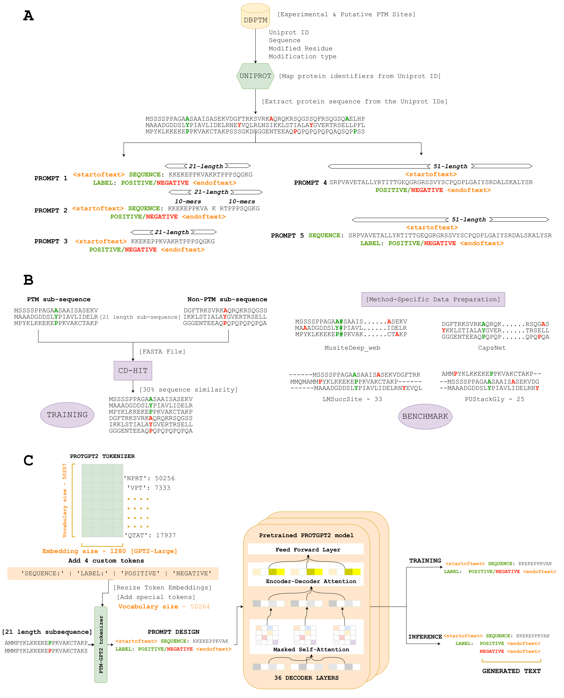

<h1>PTMGPT2</h1>

PTMGPT2 is a suite of models capable of generating tokens
that signify modified amino acid residues, crucial for identifying PTM sites. At the
core of this platform is PROTGPT2, an autoregressive transformer model, origi-
nally trained on 50 million non-annotated sequences spanning the complete spectrum
of the protein space. We have adapted PROTGPT2, utilizing it as a pre-trained
model, and further fine-tuned it for the specific task of generating classification
labels for a given protein sequence. Uniquely, PTMGPT2 employs a zero-shot text
classification approach using a generative language model, negating the need
for task-specific classification heads.

<h3>PTMGPT2 model and workflow</h3>
</img>

<h3>Download sample model for inference</h3>

Link - (https://nsclbio.jbnu.ac.kr/GPT_model/)

Contact us directly at <b>palisthashrestha7@jbnu.ac.kr</b> for bulk predictions and trained models

<h3>PTMGPT2 Webserver</h3>

Link - (https://nsclbio.jbnu.ac.kr/tools/ptmgpt2/)

<h3>Requirements</h3>

python 3.11.3   transformers 4.29.2   scikit-learn 1.2.2   pytorch 2.0.1   pytorch-cuda 11.7

<h3>Basic Usage</h3>

• Model: This folder hosts a sample model designed to predict PTM sites from given
protein sequences, illustrating PTMGPT2’s application. 
• Tokenizer: This folder contains a sample tokenizer responsible for tokenizing
protein sequences, including handcrafted tokens for specific amino acids or motifs. 
• Inference.ipynb: This file provides executable code for applying PTMGPT2 model
and tokenizer to predict PTM sites, serving as a practical guide for users to apply
the model to their datasets.

